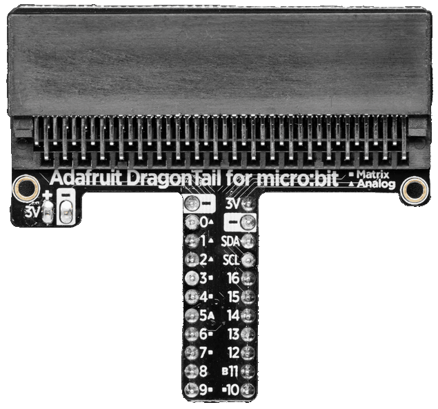
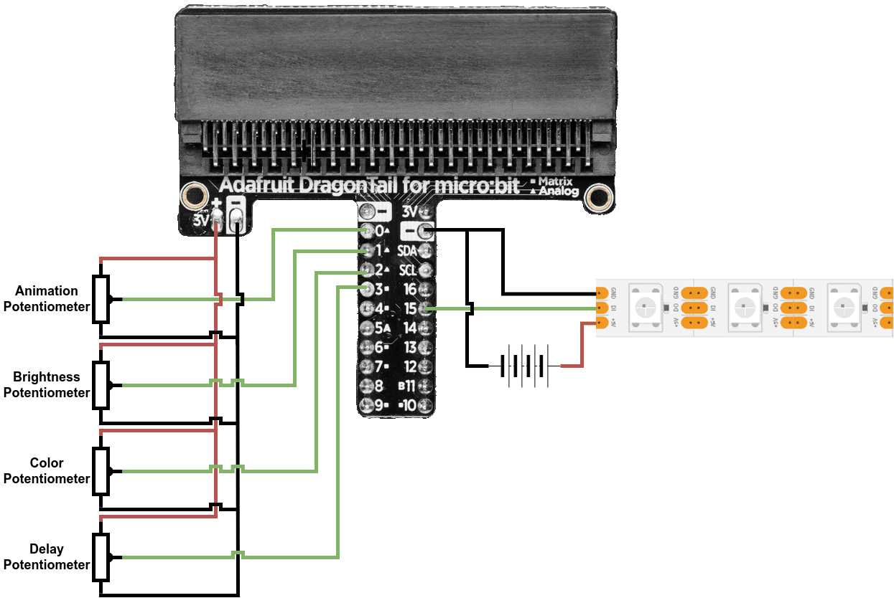

# cookie-monster-microbit-v2

## Hardware

### [Micro:bit v2](https://tech.microbit.org/hardware/)



#### Wiring



## Software

### Prerequisites

#### `cargo-binutils`

```sh
rustup component add llvm-tools-preview

cargo install cargo-binutils

cargo size --version
cargo-size 0.3.6
```

#### `probe-rs` & `cargo-embed`

On Debian and derived distros, the following packages need to be installed:

```sh
sudo apt install -y pkg-config libudev-dev
```

Then install `probe-rs` with the following command or with the latest instructions available at https://probe.rs/:

```sh
curl --proto '=https' --tlsv1.2 -LsSf https://github.com/probe-rs/probe-rs/releases/latest/download/probe-rs-tools-installer.sh | sh

cargo embed --version
cargo-embed 0.28.0
```

#### Rust Toolchain Target

```sh
rustup target add thumbv7em-none-eabihf
```

#### `gdb`

On Debian and derived distros, the following package needs to be installed:

```sh
sudo apt-get install gdb-multiarch
```

> **NOTE** `gdb-multiarch` is the GDB command you'll use to debug

#### `minicom`

On Debian and derived distros, the following package needs to be installed:

```sh
sudo apt-get install minicom
```

#### udev Rules

Create the file `/etc/udev/rules.d/99-microbit.rules` and add the following content to it:

```text
# CMSIS-DAP for Micro:bit
SUBSYSTEM=="usb", ATTR{idVendor}=="0d28", ATTR{idProduct}=="0204", MODE:="666"
```

Then reload the udev rules:

```sh
sudo udevadm control --reload-rules
```

If the micro:bit was plugged in, unplug it and then plug it in again.

Now let us verify the permissions. Make sure the micro:bit is connected with the USB cable. It should appear as a USB
device in `/dev/bus/usb`.

```sh
lsusb | grep -i "NXP ARM mbed"
Bus 003 Device 004: ID 0d28:0204 NXP ARM mbed
# ^^^        ^^^
```

In the above example, the micro:bit got connected to the bus #3 and got assigned the device #4. This means the file
`/dev/bus/usb/003/004` is the micro:bit. To check the permissions:

```sh
ls -l /dev/bus/usb/003/004
crw-rw-rw- 1 root root 189, 259 Mar  7 10:04 /dev/bus/usb/003/004
```

The permissions should be `crw-rw-rw`. If they are not, make sure to repeat the udev rules steps correctly.

### Install

The following command compiles and then flashes the application on the micro:bit. It first must be connected with a USB
cable.

```sh
cargo embed --release
```
