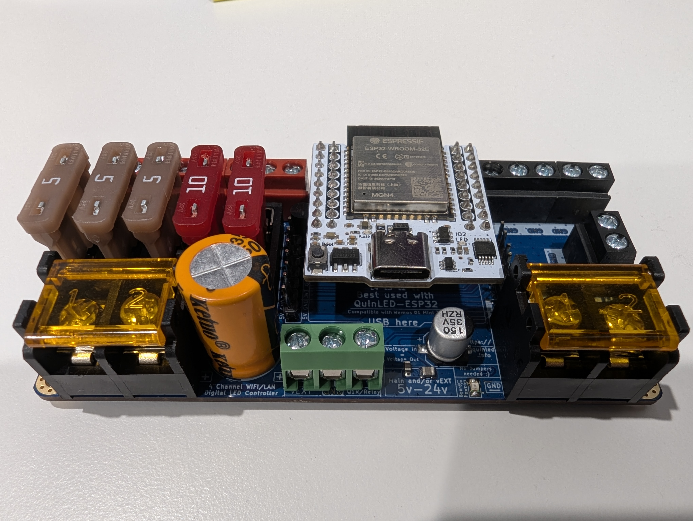
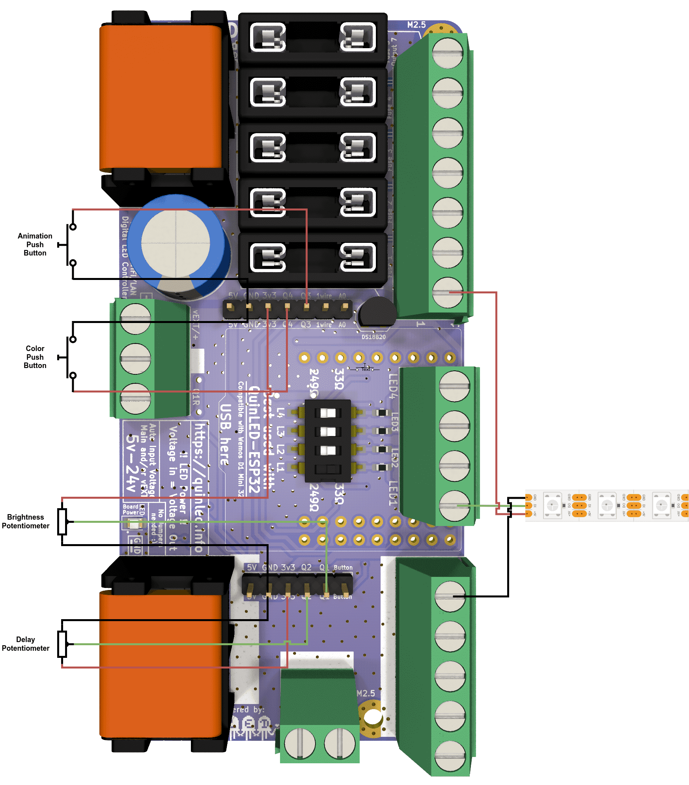

# cookie-monster-quinled-dig-quad

## Hardware

### [QuinLED Dig Quad](https://quinled.info/pre-assembled-quinled-dig-quad/)



#### Wiring



## Software

### Prerequisites

#### Install `espup`

```sh
cargo install espup
```

#### Install Necessary Toolchains

```sh
espup install
```

#### Set Up Environment Variables

`espup` creates an export file (On Unix-based systems: $HOME/export-esp.sh) that contains some environment variables
required to build projects.

To add the environment variables to your shell profile directly:

```sh
cat $HOME/export-esp.sh >> [path to profile]
source [path to profile]
```

#### Install `cargo-espflash`

```sh
cargo install cargo-espflash
```

#### Install `espflash`

```sh
cargo install espflash
```

#### Serial Port Permissions
When using any of the `espflash` commands that requires using a serial port, the current user may not have access to
serial ports and a "Permission Denied" or "Port doesn’t exist" errors may appear.

On most Linux distributions, the solution is to add the user to the dialout group (check e.g., `ls -l /dev/ttyUSB0` to
find the group) with a command like `sudo usermod -a -G dialout $USER`. You can call `su - $USER` to enable read and
write permissions for the serial port without having to log out and back in again.

### Build

```sh
cargo +esp build --target xtensa-esp32-none-elf
```

### Flash

```sh
cargo run --release
```
